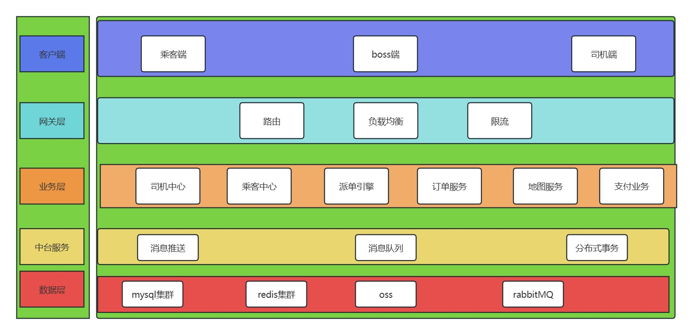
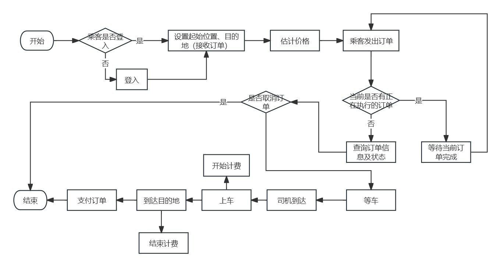
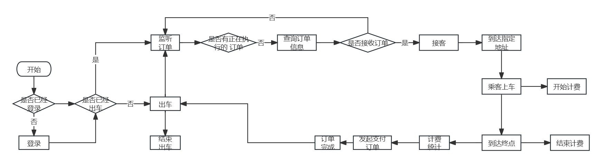

### 网约出行
- 项目介绍
```angular2html
    本项目是基于spirngcloud-Alibaba+redis+MySQL+RabbitMQ+seate+vue开发的一个网约车平台项目。项目主要分为后台管理端模块和司机端以及乘客端。通过高德地图提供导航定位服务。项目的细节我会在项目实现的过程中逐步的进行补充，这个本人第一个完全从0-1开发的全端项目，敬请期待后续的更新。
```
### spring-cloud的各个组件的版本如下：
| 组件名称 | 组件的版本      |
|------|------------|
| springboot | 2.6.13     |
| nacos | 2021.0。5.0 |
| fiegn | 暂时未确定      |
| gateway | 3.1.8      |
| seata | 暂时未确定      |
|rabbitmq|            |
|redis|            |
    
### 项目模块设计
- inner-common:通用模块
- inner-gatewagy:网关模块
- inner-model：实体相关的类
- inner-order:订单模块
- inner-platform：项目中台
- inner-service:业务模块
- inner-util：业务模块
- inner-dispatch:派单
- inner-map:地图
- inner-api:乘客端、司机端、boss端的接口提供
### 项目技术架构图


### 功能流程图：
- 乘客端

- 司机端



